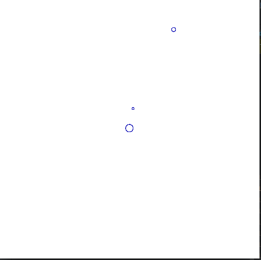

# Simulation of the Solar System

This little repository calculate the positions of planets around the Sun and give a representation of this calculation with a little animation made with OpenGL.

Here is a screen from the animation :

### How to use ?

- compile & launch 'solar_system_demo.cpp' to get the positions' data (do not forget to modify the path of the output file, line 90) 

- compile & launch 'animations.cpp' to create the animation

- enjoy an animation that could soon beat the NASA simulations !

(you can use the CMake to compile)

### Warning

The project was made during a school project just to check some results, that is why there are some problems

 - delete of variables may be incomplete

 - complexity is not optimized

 - the coding style and the use of C++ is still not correct (only a few hours of practice in C++ for this project)
 